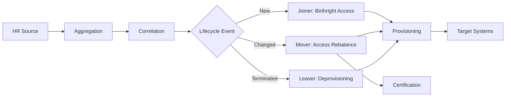

# SailPoint IIQ Governance Framework

[](LICENSE)
[](https://openjdk.org/)
[](https://maven.apache.org/)
[]()

Production-ready SailPoint IdentityIQ governance rules, patterns, and utilities — testable without a license.

---

## The Problem

I've spent years watching the same mistakes repeat across IIQ deployments:

- Birthright access hardcoded in BeanShell with nested `if/else` blocks nobody wants to touch
- Mover logic that "works" but silently lets entitlement creep through because nobody diffed the role sets properly
- Zero unit tests because "you can't test without IIQ running"
- Rules that are impossible to onboard new developers onto because the business logic is buried in 400-line scripts with no documentation

This toolkit exists because I got tired of rebuilding the same patterns from scratch on every engagement. It's the rule library I wish existed when I started working with IIQ.

## What This Is

A multi-module Maven project containing:

- **Tested, config-driven rule implementations** for the most common IIQ governance patterns
- **A mock SailPoint context layer** so you can `mvn test` without a running IIQ instance or proprietary JARs
- **Shared utilities** for the stuff every rule needs (null-safe attribute access, date math, structured logging, retry logic)
- **IIQ-importable XML templates** with BeanShell source you can drop into an SSB build or import via console
- **A Docker environment** with OpenLDAP + PostgreSQL seeded with realistic identity data for integration testing
- **Documentation that actually explains the "why"** — business context, architecture decisions, scenario walkthroughs

---

## For Beginners

New to SailPoint or identity governance? Start here.

### What is Identity Governance?

Every company has employees who need access to systems — email, code repos, HR portals, finance tools. Identity governance is the discipline of making sure the **right people** have the **right access** at the **right time**, and that access gets revoked when it shouldn't exist anymore.

When someone joins a company, they need accounts provisioned. When they switch departments, their old access should be removed and new access granted. When they leave, everything gets shut down. That lifecycle — **Joiner, Mover, Leaver** — is the core of what platforms like SailPoint IdentityIQ automate.

### What is SailPoint IdentityIQ?

SailPoint IIQ is an on-premise identity governance platform used by large enterprises (banks, hospitals, government, Fortune 500). It connects to target systems (Active Directory, LDAP, databases, SaaS apps), aggregates account data, correlates it to people, and automates access decisions through rules and workflows.

### Tutorials

If you're learning IIQ development, work through these in order:

1. **[Glossary](GLOSSARY.md)** — Learn the vocabulary first. Terms like "aggregation," "correlation," "birthright," and "provisioning plan" come up constantly. This glossary explains them in plain language.

2. **[Architecture Overview](docs/architecture-overview.md)** — Understand how data flows through IIQ: source systems → aggregation → correlation → lifecycle events → provisioning → target systems. The Mermaid diagrams show where each rule type plugs in.

3. **[Getting Started](docs/getting-started.md)** — Set up the project locally, run your first test, and understand how the mock context layer replaces a live IIQ instance for development.

4. **[Joiner Scenario](docs/scenarios/joiner-scenario.md)** — Walk through a real example: a new engineer joins the company. Follow the data from HR record to provisioning plan, step by step, with before/after tables showing exactly what changes.

5. **[Full Lifecycle Example](examples/full-joiner-mover-leaver/README.md)** — See the complete picture: one employee joins, transfers departments, and eventually leaves. Each phase shows which rule fires, what it does, and what the access state looks like after.

6. **Read the rule source code** — Start with [`JoinerBirthrightAccess.java`](rules/lifecycle/src/main/java/com/toolkit/rules/lifecycle/JoinerBirthrightAccess.java). It's ~100 lines. Read the config file next to it, then the test class. That's the pattern every rule in this toolkit follows.

### Key Concepts to Understand

| Concept | One-Line Explanation |
|---------|---------------------|
| Birthright Access | Roles you get automatically based on who you are (department, title) — no request needed |
| Entitlement Creep | Accumulating permissions over time as you change roles, without losing old access |
| Provisioning Plan | An object describing what changes to make on target systems (create account, add group, remove role) |
| Certification | Periodic review where managers verify their reports still need the access they have |
| Separation of Duties | Policy that prevents one person from holding conflicting permissions (e.g., create + approve payments) |

For the full list, see the [Glossary](GLOSSARY.md).

---

## Modules

| Module | What It Does | Status |
|--------|-------------|--------|
| [`mock-context`](mock-context/) | In-memory stubs for `Identity`, `Link`, `Bundle`, `ProvisioningPlan`, `SailPointContext` | Ready |
| [`common-utils`](common-utils/) | `SafeAttributeUtils`, `DateUtils`, `LoggingUtils`, `ConnectorErrorHandler` | Ready |
| [`rules/lifecycle`](rules/lifecycle/) | `JoinerBirthrightAccess`, `MoverAccessRebalance` | Ready |
| [`rules/aggregation`](rules/aggregation/) | `CustomSchemaMapping`, `NestedGroupFlattener` | Ready |
| [`rules/correlation`](rules/correlation/) | `WeightedMultiAttributeCorrelation`, `FuzzyMatchCorrelation` | Ready |
| [`rules/provisioning`](rules/provisioning/) | `AttributeDrivenGroupAssignment`, `BeforeProvisioningSoDCheck` | Ready |
| [`rules/certification`](rules/certification/) | `ServiceAccountExclusion`, `RiskBasedCertScoping` | Ready |
| [`rules/policy`](rules/policy/) | `SoDViolationDetector`, `EntitlementCreepDetector` | Ready |
| [`rules/workflow`](rules/workflow/) | `ApprovalEscalation`, `DynamicApprovalRouting` | Ready |
| [`xml-templates`](xml-templates/) | Ready-to-import IIQ XML rule definitions | Ready |
| [`docker`](docker/) | OpenLDAP + PostgreSQL with seed data | Ready |

---

## Quick Start

```bash
git clone https://github.com/sworuptima/sailpoint-iiq-governance-framework.git
cd sailpoint-iiq-governance-framework
mvn clean install
```

That's it. No SailPoint license, no app server, no database. The mock context layer handles everything.

To spin up the integration test environment:

```bash
cd docker && docker-compose up -d
```

This gives you an LDAP directory and HR database with 10 sample identities across 4 departments, matching the rule configurations.

---

## Architecture



Every rule is **configuration-driven**. Department-to-role mappings, sensitive role lists, certification triggers — all externalized to JSON. The rule code handles the logic; the config handles the policy. This mirrors what you'd do in production with Custom objects, but without the deployment overhead during development.

The utility layer uses **reflection-based attribute access** (`SafeAttributeUtils.getStringAttribute`) so the same code works against mock objects in tests and real SailPoint objects in production — no compile-time dependency on the proprietary JAR.

See [Architecture Overview](docs/architecture-overview.md) for the full breakdown.

---

## Implemented Rules

### JoinerBirthrightAccess

Config-driven birthright role assignment. Resolves global roles + department roles + title roles, deduplicates against existing assignments, and builds the provisioning plan. Handles unknown departments gracefully (global roles only) and never double-assigns.

[Documentation](rules/lifecycle/README.md#joinerbirthrightaccess) · [Scenario walkthrough](docs/scenarios/joiner-scenario.md)

### MoverAccessRebalance

Diffs old and new department role sets, removes what's no longer applicable, adds what's newly required, preserves global roles, and flags for certification when sensitive roles are involved. Returns a `MoverResult` with the plan, cert flag, and a human-readable summary.

[Documentation](rules/lifecycle/README.md#moveraccessrebalance) · [End-to-end example](examples/full-joiner-mover-leaver/README.md)

### CustomSchemaMapping

Maps non-standard source system attributes into a normalized IIQ schema. Each application gets its own attribute translation table — AD's `sAMAccountName` becomes `accountName`, HR's `EMPLOYEE_ID` becomes `employeeId`. Unmapped attributes pass through unchanged.

[Documentation](rules/aggregation/README.md#customschemamapping)

### NestedGroupFlattener

Flattens hierarchical AD group memberships into a single list. Resolves parent groups recursively with configurable depth limits and circular reference protection. Accepts both list and delimited string inputs.

[Documentation](rules/aggregation/README.md#nestedgroupflattener)

### WeightedMultiAttributeCorrelation

Scores candidate identities across multiple attributes with configurable weights. EmployeeId match = 100 points, email = 80, last name = 30. Best score above threshold wins. Case-insensitive by default.

[Documentation](rules/correlation/README.md#weightedmultiattributecorrelation)

### FuzzyMatchCorrelation

Uses Levenshtein edit distance for approximate string matching during correlation. Handles typos, name variations, and inconsistent formatting. Checks exact-match attributes first, falls back to fuzzy scoring.

[Documentation](rules/correlation/README.md#fuzzymatchcorrelation)

### AttributeDrivenGroupAssignment

Computes target system group memberships from identity attributes. Maps departments to AD groups, locations to office groups, and adds global groups. Builds the provisioning plan automatically.

[Documentation](rules/provisioning/README.md#attributedrivengroupassignment)

### BeforeProvisioningSoDCheck

Validates Separation of Duties before provisioning executes. Collects current + requested roles, checks every pair against a conflict matrix, and either blocks or flags violations. Supports exempt roles for emergency access.

[Documentation](rules/provisioning/README.md#beforeprovisioningsodcheck)

### ServiceAccountExclusion

Excludes service and system accounts from manager certification campaigns. Matches name patterns (`svc_*`, `system_*`), checks identity type attributes, filters inactive identities and disabled accounts.

[Documentation](rules/certification/README.md#serviceaccountexclusion)

### RiskBasedCertScoping

Scopes certification campaigns to high-risk entitlements only. Evaluates risk scores, checks for high-risk role assignments, and detects privilege-indicating attributes. Reduces review fatigue by focusing on what matters.

[Documentation](rules/certification/README.md#riskbasedcertscoping)

### SoDViolationDetector

Scans identities for Separation of Duties violations against a configurable conflict matrix. Categorizes violations by severity (critical, high, medium). Supports single-identity and bulk scanning modes.

[Documentation](rules/policy/README.md#sodviolationdetector)

### EntitlementCreepDetector

Identifies identities with significantly more access than their peers. Groups by department, computes average role count, and flags outliers exceeding a configurable multiplier. Excludes global roles from the comparison.

[Documentation](rules/policy/README.md#entitlementcreepdetector)

### ApprovalEscalation

Escalates pending approvals through a tiered chain: manager → director → security team. Configurable timeout periods at each level. Optional auto-approve after maximum wait and reminder notifications.

[Documentation](rules/workflow/README.md#approvalescalation)

### DynamicApprovalRouting

Routes approval requests based on risk score and application sensitivity. Low-risk requests go to the manager with single approval; critical requests require the security team with three approval levels.

[Documentation](rules/workflow/README.md#dynamicapprovalrouting)

---

## Project Structure

```
sailpoint-iiq-governance-framework/
├── pom.xml                        # Multi-module Maven parent
├── mock-context/                  # SailPoint API mocks
├── common-utils/                  # Shared utilities
├── rules/
│   ├── lifecycle/                 # Joiner, Mover
│   ├── aggregation/               # Schema mapping, group flattening
│   ├── correlation/               # Weighted matching, fuzzy matching
│   ├── provisioning/              # Group assignment, SoD validation
│   ├── certification/             # Service account exclusion, risk scoping
│   ├── policy/                    # SoD detection, entitlement creep
│   └── workflow/                  # Approval escalation, dynamic routing
├── xml-templates/                 # IIQ-importable rule XML
├── docker/                        # OpenLDAP + PostgreSQL demo
├── docs/
│   ├── architecture-overview.md
│   ├── getting-started.md
│   └── scenarios/
└── examples/
    └── full-joiner-mover-leaver/
```

---

## Docs

- [Getting Started](docs/getting-started.md) — setup, first test, Docker environment
- [Architecture Overview](docs/architecture-overview.md) — lifecycle flow, module dependencies, design rationale
- [Glossary](GLOSSARY.md) — IAM and SailPoint terminology
- [Joiner Scenario](docs/scenarios/joiner-scenario.md) — step-by-step with before/after data
- [Full Lifecycle](examples/full-joiner-mover-leaver/README.md) — joiner → mover → leaver end-to-end

---

## Author

Built by [Sworup Timalsina](https://github.com/sworuptima) · [LinkedIn](https://www.linkedin.com/in/sworup-timalsina/)

## Contributing

PRs welcome, especially for the planned modules. See [CONTRIBUTING.md](CONTRIBUTING.md).

## License

Apache 2.0 — see [LICENSE](LICENSE).
