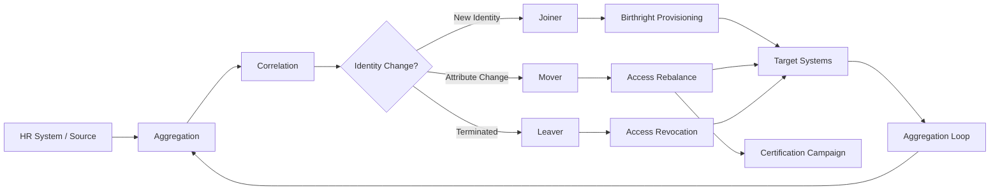
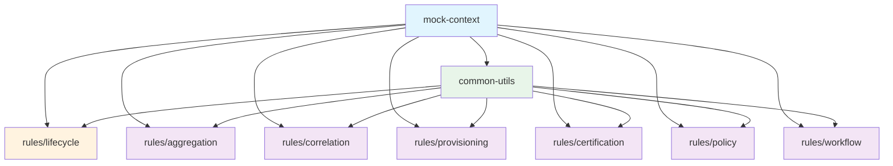
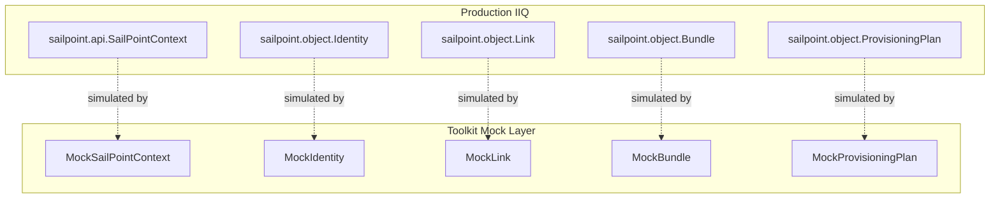

# Architecture Overview

How the toolkit mirrors the SailPoint IdentityIQ identity lifecycle, and where each component fits.

## Identity Lifecycle

Every identity governance implementation revolves around the same fundamental cycle: data comes in from source systems, gets correlated to identities, triggers lifecycle events, and results in provisioning actions on target systems.



### Where Each Rule Type Plugs In

| Lifecycle Stage | Rule Module | What It Does |
|----------------|-------------|--------------|
| Aggregation | `rules/aggregation` | Transforms and normalizes data as it's read from source systems |
| Correlation | `rules/correlation` | Matches aggregated accounts to identities using business logic |
| Joiner | `rules/lifecycle` | Assigns birthright access based on department, title, location |
| Mover | `rules/lifecycle` | Detects attribute changes, rebalances roles, triggers reviews |
| Leaver | `rules/lifecycle` | Disables accounts, revokes access, preserves data |
| Provisioning | `rules/provisioning` | Customizes how changes are applied to target systems |
| Certification | `rules/certification` | Controls what gets reviewed, by whom, and how |
| Policy | `rules/policy` | Detects violations (SoD, entitlement creep, orphan accounts) |
| Workflow | `rules/workflow` | Coordinates multi-step processes (approvals, escalations) |

## Module Dependencies



**mock-context** (blue) provides the SailPoint API simulation layer — every rule module depends on it for type definitions and testing.

**common-utils** (green) provides shared helpers — null-safe attribute access, date utilities, structured logging, and error handling.

**Rule modules** (orange/purple) contain the actual business logic — each module handles a specific stage of the identity lifecycle.

## Configuration-Driven Design

A core principle of this toolkit: **business logic belongs in configuration, not in code**.

Every rule reads its decision-making data from a configuration map rather than hardcoding values. This means:

- **Department-to-role mappings** live in JSON config files, not in Java conditions
- **Sensitive role lists** are configurable, not enumerated in code
- **Certification thresholds** are parameters, not constants

This pattern mirrors SailPoint best practices, where production deployments store configuration in Custom objects that administrators can update without code deployments.

```
Rule Code (static)  +  Configuration (dynamic)  =  Business Behavior
```

### Example: Changing a birthright mapping

To add a new department's birthright roles, you edit `joiner-birthright-config.json`:

```json
{
  "departmentRoleMappings": {
    "Legal": ["Legal Research Tools", "Contract Management", "Compliance Portal"]
  }
}
```

No Java code changes. No recompilation. The same rule handles the new department automatically.

## Mock Layer Architecture

The mock layer replaces the proprietary SailPoint API with lightweight in-memory implementations:



The mock classes mirror the method signatures that rules use — `getAttribute()`, `getLinks()`, `getBundles()`, etc. — so that rule logic written against the mock layer transfers directly to production IIQ with minimal changes.

The `common-utils` module uses reflection-based attribute access (`SafeAttributeUtils`) so that the same utility code works with both mock objects and real SailPoint objects without a compile-time dependency on the proprietary SailPoint JAR.

## Testing Strategy

```
Unit Tests (mock-context)
    |
    v
Rule Tests (JUnit + mock data)
    |
    v
Integration Tests (Docker: LDAP + PostgreSQL)
    |
    v
Production Deployment (IIQ instance)
```

1. **Unit tests** verify mock layer behavior (object creation, attribute access, plan building)
2. **Rule tests** verify business logic against simulated identities and configurations
3. **Integration tests** (optional) run rules against live LDAP and database containers
4. **Production deployment** imports XML rule templates into a running IIQ instance
