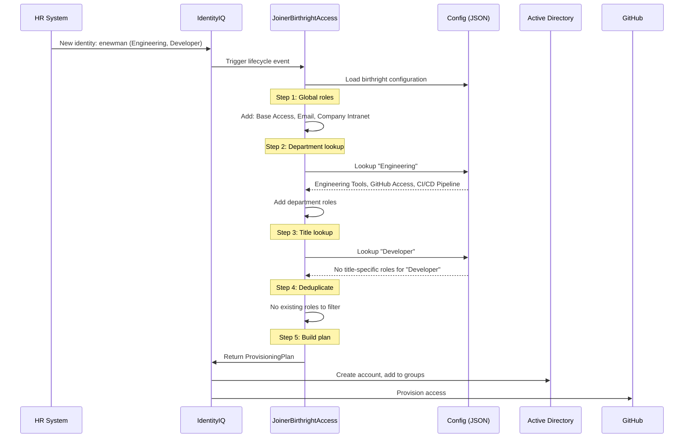

# Scenario: New Employee Joins Engineering

A step-by-step walkthrough of the JoinerBirthrightAccess rule processing a new hire.

## Overview

Emily Newman is a new Developer joining the Engineering department. Her identity was aggregated from the HR system into IdentityIQ. The JoinerBirthrightAccess rule needs to determine what access she should receive automatically.

## Identity Attributes

| Attribute | Value |
|-----------|-------|
| Username | enewman |
| First Name | Emily |
| Last Name | Newman |
| Email | enewman@toolkit.local |
| Department | Engineering |
| Title | Developer |
| Manager | Michael Chen (mchen) |
| Start Date | 2026-03-01 |
| Location | Remote |

## Before: Current Access

Emily has just been aggregated. She has no accounts, no roles, no entitlements.

| Application | Account | Roles | Entitlements |
|-------------|---------|-------|-------------|
| *(none)* | *(none)* | *(none)* | *(none)* |

## Configuration

The rule loads this configuration:

```json
{
  "globalBirthrightRoles": ["Base Access", "Email", "Company Intranet"],
  "departmentRoleMappings": {
    "Engineering": ["Engineering Tools", "GitHub Access", "CI/CD Pipeline"]
  },
  "titleRoleMappings": {
    "Manager": ["Manager Dashboard", "Approval Authority"]
  }
}
```

## Step-by-Step Execution



### Step 1: Load global birthright roles

Every new identity receives these regardless of department or title:
- Base Access
- Email
- Company Intranet

### Step 2: Look up department-based roles

Emily's department is "Engineering." The config maps this to:
- Engineering Tools
- GitHub Access
- CI/CD Pipeline

### Step 3: Look up title-based roles

Emily's title is "Developer." There is no entry for "Developer" in `titleRoleMappings`, so no additional roles are added. (If she were a "Manager," she would also receive "Manager Dashboard" and "Approval Authority.")

### Step 4: Deduplicate

Emily has no existing roles, so there's nothing to filter out. If she already had "Base Access" from a previous process, it would be excluded from the plan.

### Step 5: Build the ProvisioningPlan

The rule assembles all 6 roles into a provisioning plan:

## ProvisioningPlan Output

```
ProvisioningPlan for: enewman
  Account: IIQ [Modify]
    Add assignedRoles = Base Access
    Add assignedRoles = Email
    Add assignedRoles = Company Intranet
    Add assignedRoles = Engineering Tools
    Add assignedRoles = GitHub Access
    Add assignedRoles = CI/CD Pipeline
```

## After: Access State

After the provisioning plan executes:

| Application | Account | Roles/Entitlements |
|-------------|---------|-------------------|
| IIQ | enewman | Base Access, Email, Company Intranet, Engineering Tools, GitHub Access, CI/CD Pipeline |
| Active Directory | CN=enewman,OU=Engineering,DC=toolkit,DC=local | Member of: Engineering Tools, GitHub Access |
| GitHub | enewman | Organization member, Engineering team |

## Verification

To verify this scenario in tests:

```bash
mvn test -pl rules/lifecycle -Dtest=JoinerBirthrightAccessTest#testNewEngineer
```

The test creates a mock identity with `department=Engineering` and `title=Developer`, runs the rule, and asserts that the plan contains all expected roles.

## Variations

### What if Emily were a Manager?

With `title=Manager`, she would also receive:
- Manager Dashboard
- Approval Authority

**Total roles: 8** (6 from above + 2 title-based)

### What if Emily's department were unknown?

If her department were "Research" (not in the config), she would receive only the 3 global birthright roles.

### What if Emily already had Base Access?

If she were somehow pre-assigned "Base Access," the rule would detect the duplicate and assign only the remaining 5 roles. The plan would show 5 `Add` operations instead of 6.

### What if the config were empty?

With an empty configuration, the rule produces an empty plan — no roles assigned. This is a safety measure; if the config is misconfigured, it fails safe rather than granting excessive access.

## Audit Trail

The rule produces structured log entries at each step:

```
INFO  [JoinerBirthrightAccess] Processing identity: enewman
INFO  [JoinerBirthrightAccess] identity=enewman action=assignRole detail=Base Access
INFO  [JoinerBirthrightAccess] identity=enewman action=assignRole detail=Email
INFO  [JoinerBirthrightAccess] identity=enewman action=assignRole detail=Company Intranet
INFO  [JoinerBirthrightAccess] identity=enewman action=assignRole detail=Engineering Tools
INFO  [JoinerBirthrightAccess] identity=enewman action=assignRole detail=GitHub Access
INFO  [JoinerBirthrightAccess] identity=enewman action=assignRole detail=CI/CD Pipeline
INFO  [JoinerBirthrightAccess] Completed identity: enewman, result: 6 roles assigned
```

These log entries are produced by `LoggingUtils` and follow a consistent format across all rules, making them easy to search and audit.
