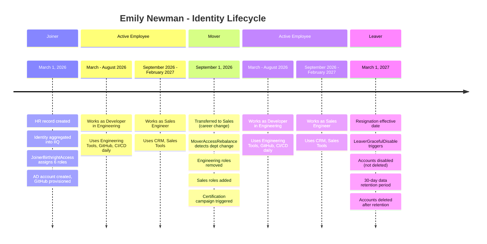

# End-to-End Scenario: Joiner, Mover, Leaver

A complete walkthrough of one employee's identity lifecycle — from first day to last — showing how each rule processes access changes.

## Timeline



## Phase 1: Joiner

**Date**: March 1, 2026
**Event**: Emily Newman starts as a Developer in Engineering

### Before

Emily exists in the HR system but has no IIQ identity, no accounts, no access.

### What Happens

1. HR feed aggregation runs, discovers new employee record
2. Identity created in IIQ: `enewman`
3. **JoinerBirthrightAccess** fires:
   - Loads config, resolves department ("Engineering") and title ("Developer")
   - Assigns: Base Access, Email, Company Intranet, Engineering Tools, GitHub Access, CI/CD Pipeline
4. Provisioning engine executes the plan:
   - Creates AD account: `CN=enewman,OU=Engineering,DC=toolkit,DC=local`
   - Provisions GitHub organization membership
   - Adds to Engineering Tools group

### After

| Role | Source | Application |
|------|--------|-------------|
| Base Access | Birthright (global) | IIQ |
| Email | Birthright (global) | Exchange |
| Company Intranet | Birthright (global) | SharePoint |
| Engineering Tools | Birthright (department) | Active Directory |
| GitHub Access | Birthright (department) | GitHub |
| CI/CD Pipeline | Birthright (department) | Jenkins |

**Test**: `mvn test -pl rules/lifecycle -Dtest=JoinerBirthrightAccessTest#testNewEngineer`

See [Joiner Scenario](../../docs/scenarios/joiner-scenario.md) for the detailed walkthrough.

---

## Phase 2: Mover

**Date**: September 1, 2026
**Event**: Emily transfers from Engineering to Sales

### Before

Emily has all her Engineering birthright roles plus the global roles.

### What Happens

1. HR feed updates Emily's department from "Engineering" to "Sales"
2. Identity refresh detects the attribute change
3. **MoverAccessRebalance** fires:
   - Computes old department roles: Engineering Tools, GitHub Access, CI/CD Pipeline
   - Computes new department roles: CRM Access, Sales Tools, Lead Database
   - Identifies overlap: none (disjoint sets)
   - Removes: Engineering Tools, GitHub Access, CI/CD Pipeline
   - Adds: CRM Access, Sales Tools, Lead Database
   - Global roles retained: Base Access, Email, Company Intranet
   - Certification triggered (alwaysCertifyOnDepartmentChange = true)

### After

| Role | Source | Status |
|------|--------|--------|
| Base Access | Birthright (global) | Retained |
| Email | Birthright (global) | Retained |
| Company Intranet | Birthright (global) | Retained |
| Engineering Tools | ~~Birthright (department)~~ | **Removed** |
| GitHub Access | ~~Birthright (department)~~ | **Removed** |
| CI/CD Pipeline | ~~Birthright (department)~~ | **Removed** |
| CRM Access | Birthright (department) | **Added** |
| Sales Tools | Birthright (department) | **Added** |
| Lead Database | Birthright (department) | **Added** |

**Certification**: A focused certification campaign is triggered for Emily's manager to review and confirm the access changes.

**Test**: `mvn test -pl rules/lifecycle -Dtest=MoverAccessRebalanceTest#testEngineeringToSales`

---

## Phase 3: Leaver

**Date**: March 1, 2027
**Event**: Emily resigns, effective immediately

### Before

Emily has Sales department roles plus global roles.

### What Happens

*(LeaverGracefulDisable is planned — this describes the intended behavior)*

1. HR feed updates Emily's status to "terminated" with end date March 1, 2027
2. Identity refresh detects the termination flag
3. **LeaverGracefulDisable** fires:
   - Immediately disables (not deletes) all accounts
   - Removes all non-global role assignments
   - Sets identity to inactive in IIQ
   - Starts 30-day data retention countdown
   - Notifies Emily's manager and IT security
4. After 30-day retention:
   - All accounts deleted from target systems
   - Links removed from IIQ identity
   - Identity marked as archived

### After (Immediate)

| Role | Status |
|------|--------|
| All roles | **Revoked** |
| AD Account | **Disabled** |
| CRM Account | **Disabled** |
| Email | **Disabled** |

### After (30 Days)

| Resource | Status |
|----------|--------|
| All accounts | **Deleted** |
| IIQ Identity | **Archived** |

---

## Key Takeaways

1. **Birthright access is automatic** — Emily never had to request her initial access
2. **Movers don't accumulate old access** — Engineering roles were removed when she moved to Sales
3. **Sensitive changes trigger review** — The department change automatically launched a certification
4. **Leavers are disabled immediately** — No gap between termination and access revocation
5. **Audit trail is complete** — Every change is logged with the rule name, identity, and action

## Running the Tests

```bash
# Run all lifecycle tests
mvn test -pl rules/lifecycle

# Run specific scenario tests
mvn test -pl rules/lifecycle -Dtest=JoinerBirthrightAccessTest
mvn test -pl rules/lifecycle -Dtest=MoverAccessRebalanceTest
```

## Related Documentation

- [Architecture Overview](../../docs/architecture-overview.md) — where lifecycle rules fit in the IIQ lifecycle
- [Joiner Scenario](../../docs/scenarios/joiner-scenario.md) — detailed step-by-step for the joiner phase
- [Lifecycle Rules README](../../rules/lifecycle/README.md) — rule documentation and configuration
- [Glossary](../../GLOSSARY.md) — IAM terminology explained
