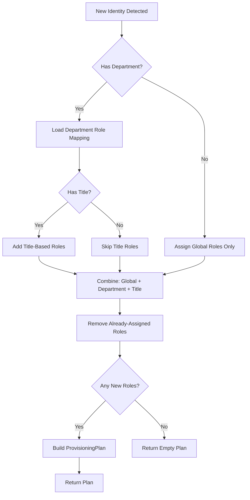
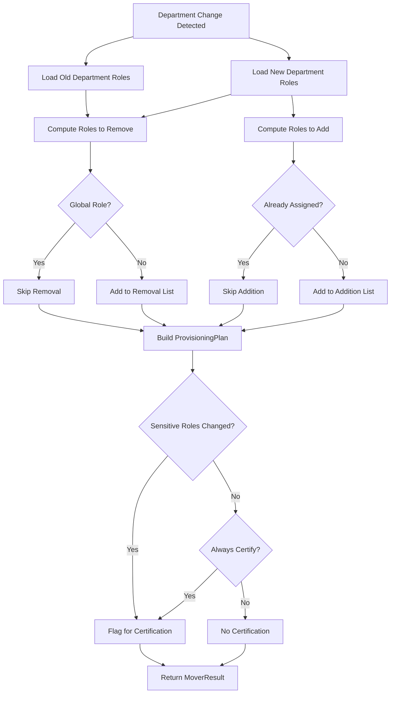

# Lifecycle Rules

Rules that execute during identity lifecycle events: when someone joins the organization, moves between departments, or leaves.

## Business Context

Every organization faces the same identity challenge: people join, they change roles, and eventually they leave. Without automation, each of these transitions creates risk:

- **Joiners** wait days for access, can't do their job, and IT gets buried in manual provisioning tickets.
- **Movers** accumulate access from their old role on top of their new role — "entitlement creep" — creating audit findings and security exposure.
- **Leavers** retain active accounts for weeks after departure, giving attackers a window to exploit dormant credentials.

These rules automate the access decisions that need to happen at each stage.

---

## JoinerBirthrightAccess

### What It Does

When a new identity is detected (via HR feed aggregation or manual creation), this rule assigns a baseline set of roles — "birthright access" — based on the employee's department and title.

### Flow



### Configuration

Edit `src/main/resources/joiner-birthright-config.json`:

| Key | Type | Description |
|-----|------|-------------|
| `globalBirthrightRoles` | List | Roles assigned to every new identity |
| `departmentRoleMappings` | Map | Department name to list of role names |
| `titleRoleMappings` | Map | Title to list of additional role names |

### Example

An engineer joining with the title "Developer" receives:
- **Global**: Base Access, Email, Company Intranet
- **Department (Engineering)**: Engineering Tools, GitHub Access, CI/CD Pipeline
- **Title (Developer)**: *(no title-specific roles for this title)*

### Testing

```bash
cd rules/lifecycle
mvn test -Dtest=JoinerBirthrightAccessTest
```

---

## MoverAccessRebalance

### What It Does

When an employee changes departments, this rule compares the role mappings for the old and new departments. It removes roles specific to the old department, adds roles for the new department, and flags the identity for certification review when sensitive access is involved.

### Flow



### Configuration

Edit `src/main/resources/mover-rebalance-config.json`:

| Key | Type | Description |
|-----|------|-------------|
| `departmentRoleMappings` | Map | Department name to list of role names |
| `sensitiveRoles` | List | Roles that trigger mandatory certification when removed |
| `globalRoles` | List | Roles that are never removed during rebalance |
| `alwaysCertifyOnDepartmentChange` | Boolean | If true, every department change triggers certification |
| `retainGlobalRoles` | Boolean | If true, global roles survive department changes |
| `gracePeriodDays` | Integer | Days before removed access is actually revoked |

### Example

An employee moves from Finance to Engineering:
- **Removed**: Finance Systems, Reporting Tools, Budget Portal
- **Added**: Engineering Tools, GitHub Access, CI/CD Pipeline
- **Retained**: Base Access, Email, Company Intranet
- **Certification**: Triggered (Finance Systems is a sensitive role)

### Testing

```bash
cd rules/lifecycle
mvn test -Dtest=MoverAccessRebalanceTest
```

---

## Planned Rules

| Rule | Status | Description |
|------|--------|-------------|
| `LeaverGracefulDisable` | Planned | Disables accounts with grace period, preserves data for compliance |
| `RehireDetection` | Planned | Detects returning employees and restores appropriate access |

Contributions welcome — see [CONTRIBUTING.md](../../CONTRIBUTING.md).
